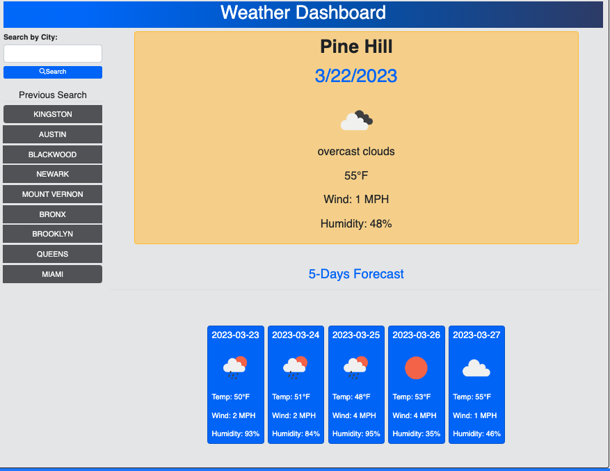
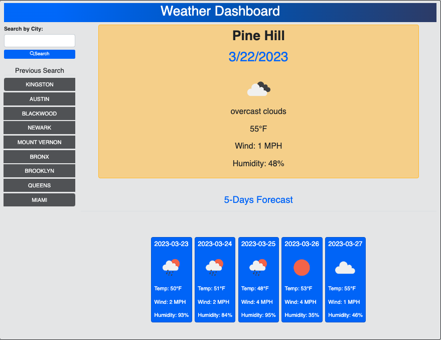
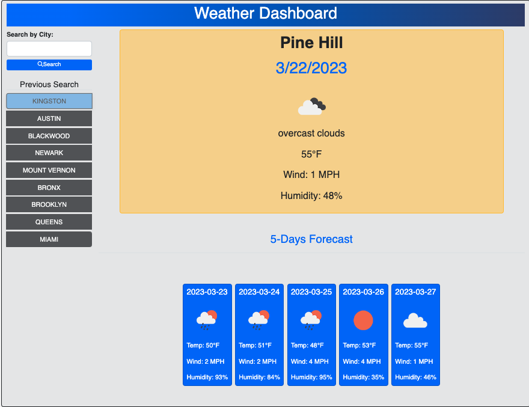
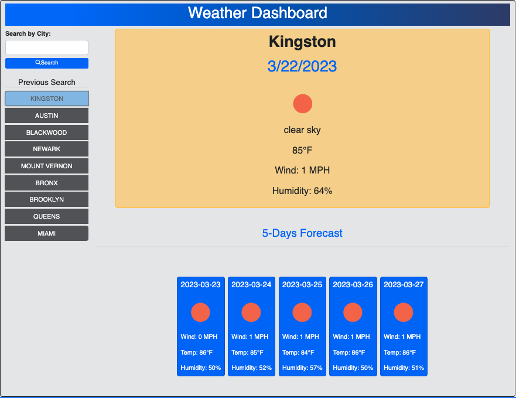
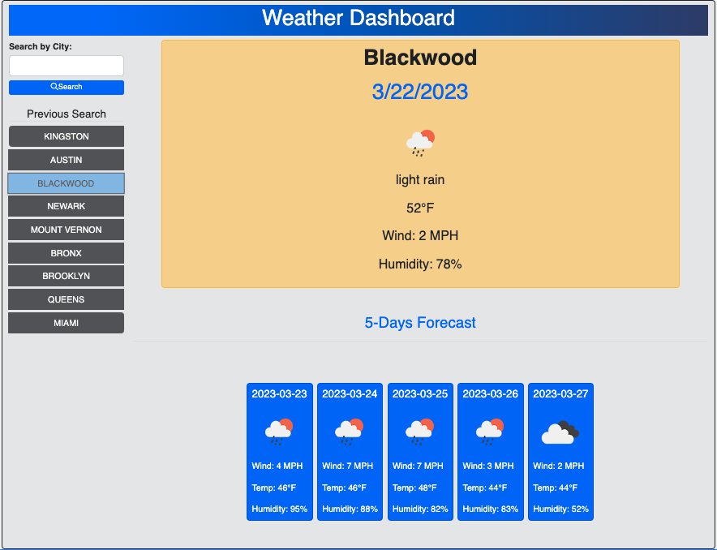

# weather_dashborad_module_6

This web application is used to get the weather by city and current location

## Table of Contents

- [Installation](#installation) 
- [Usage](#usage) 
- [Features](#features) 
- [Contributing](#contributing)
- [License](#license)
- [Credits](#credits)
- [Contact](#contact)

## Installation
 - N/A

## Usage

- click the link - (https://kenneilsmith.github.io/weather_dashborad_module_6/)

## Features

- On load the app request the current location of the user and displays the current weather and 5 days forecast
- The user can search for a specific city and that city's current weather and 5 days forecast will be displayed
- The previous 10 searched cities can be accessed for fast search

## License

This project is licensed under the MIT License.

## Credits
   -     JD TodLock - Bootcamp Instuctor
   -     Justyn Subrai - Bootcamp TA
   -     Paul Cwik - Bootcamp TA

## Contact

Damian Smith - damiansmith61@gmail.com \
Project Link: https://github.com/kenneilsmith/
